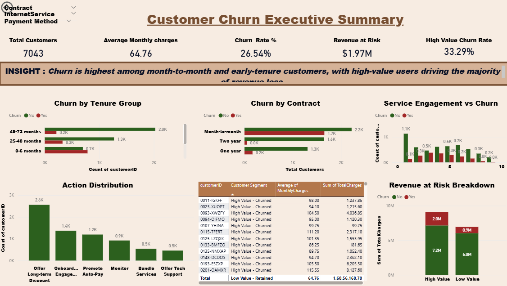
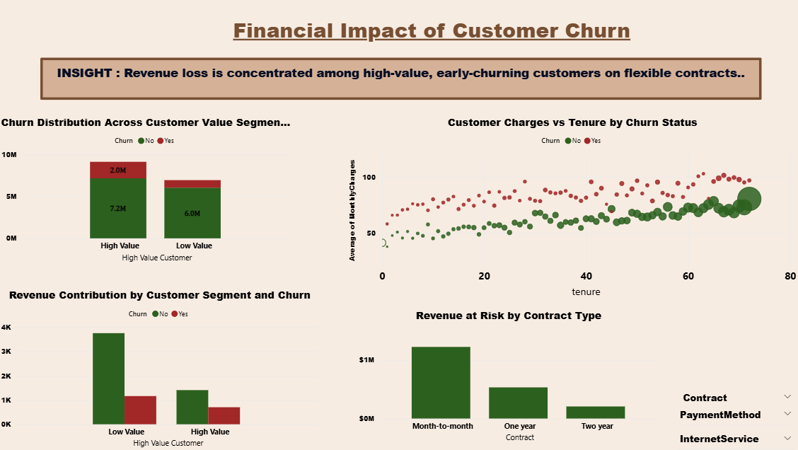
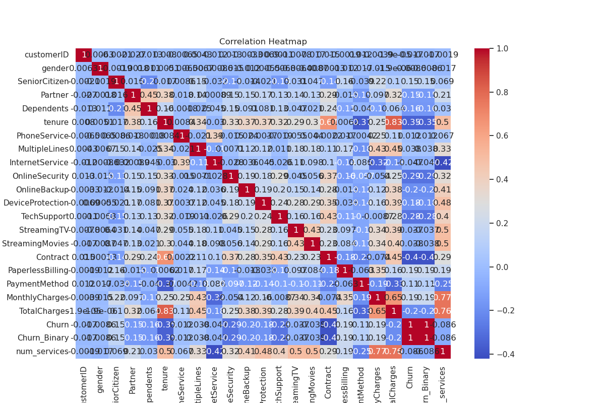
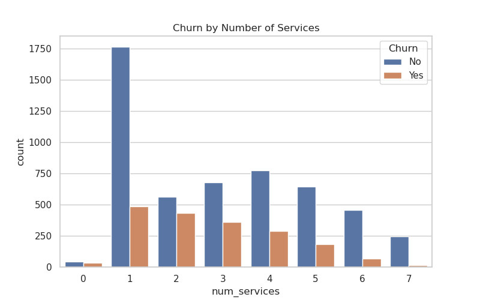
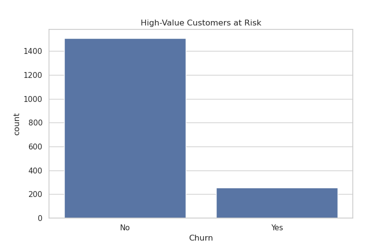

# End-to-end churn analysis using Python with feature engineering, customer segmentation, and a rule-based retention strategy to reduce revenue loss.

## Overview

This project performs an end-to-end analysis of customer churn using the IBM Telco dataset (~7,043 customers, 21 features).

The focus is on Python-driven analysis to identify churn drivers, high-risk segments, and revenue at risk, followed by a business-oriented retention strategy, with insights visualized in Power BI.

 Dashboard Preview
##  Dashboard Preview

## Objective
- Identify key factors driving customer churn
- Segment customers based on risk and value
- Quantify financial impact of churn
- Build actionable retention strategies
  
## Tools & Technologies
- Python – Data analysis, feature engineering, logic building
- Libraries – Pandas, NumPy, Matplotlib, Seaborn
- Power BI – Dashboard and business visualization
  
## Dataset
- Source: IBM Telco Customer Churn Dataset
- Customers: 7,043
- Features: 21 variables including services, billing, tenure, and churn

## Python Analysis (Core)
### Data Cleaning
- Handled missing values in TotalCharges (~11 records)
- Converted data types for numerical consistency
- Standardized categorical variables
### Exploratory Analysis
- Overall churn rate: ~26.5%
- Highest churn observed in month-to-month contracts (~40%+)
- Early tenure customers (<6 months) show significantly higher churn

  
### Feature Engineering
To enhance analytical depth and uncover meaningful patterns, the following features were engineered:

- #### Customer Engagement Score (num_services)
Aggregated number of services used by each customer to measure engagement level and product adoption.

- #### High-Value Customer Segment
Identified top ~30% customers based on monthly charges to analyze churn behavior among high-revenue users.

- #### Tenure Segmentation
Grouped customers into lifecycle stages (e.g., 0–12 months, 12–24 months, 24+ months) to study churn trends across different customer lifespans.
- #### Customer Segmentation (Value × Churn)
Classified customers into segments such as High Value–High Risk and Low Value–Low Risk to support targeted retention strategies.

### Action Framework 
A rule-based retention model was developed:

- High-value customers → VIP Support
- Early tenure (<6 months) → Onboarding Engagement
- Month-to-month → Contract Conversion Offers
- Low engagement (≤2 services) → Service Bundling
- No tech support → Support Upsell
  
## Key Results
- ~26.5% overall churn rate
- Month-to-month customers contribute the majority of churn
- Customers with ≤2 services show significantly higher churn risk
- High-value customers account for a disproportionate share of revenue at risk
- Lack of tech support strongly correlates with churn

## Power BI Dashboard

A 4-page dashboard was built to translate analysis into business insights:

- Executive Summary
- Customer Lifecycle Analysis
- Churn Drivers
- Financial Impact
  _Focus: Converting Python analysis into decision-making insights_

## Business Impact
This analysis enables:

- Identification of high-risk, high-value customers
- Reduction of churn through targeted interventions
- Protection of revenue streams in subscription-based businesses

_Applicable to telecom, SaaS, and subscription models_

## Repository Structure
customer-churn-analysis/
│
├── README.md
├── telco_analysis.ipynb
├── dashboard.pbix
├── images/

## How to Use
- Run the Jupyter Notebook to explore analysis
- Open the .pbix file in Power BI Desktop
- Interact with filters to explore segments

## Key Learnings
- Feature engineering for behavioral segmentation
- Translating data into actionable business insights
- Combining Python analysis with business dashboards
